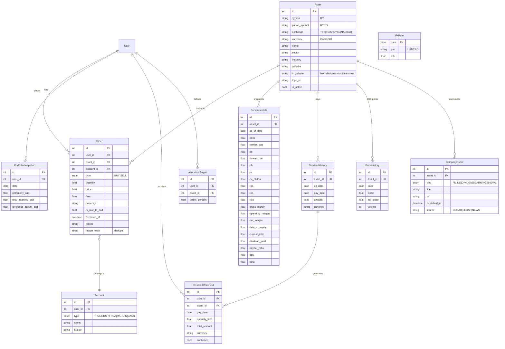

# Modelo de Datos Objetivo

## Notas de diseño

- **Posiciones derivadas**: no hay tabla `Portfolio` editable — la posición actual se calcula
  desde `Order` (cacheable en memoria o vista materializada regenerable). Evita el bug actual
  de duplicación en cada import.
- **Fundamentals como snapshots**: una fila por asset por día de refresh → permite gráficos de
  evolución de P/E, DY histórico, etc. Vista `latest_fundamentals` para el screener.
- **Average cost (CRA)**: el costo promedio se calcula global por asset entre cuentas no
  registradas (regla canadiense); en TFSA/RRSP no tributa pero se muestra igual.
- **`import_hash`**: hash de (fecha, símbolo, tipo, qty, precio, broker) para no duplicar
  órdenes al re-importar el mismo CSV.
- **FX**: toda métrica agregada del portafolio se muestra en CAD usando `FxRate` del día; la
  orden guarda el fx del día de ejecución para el costo real.
